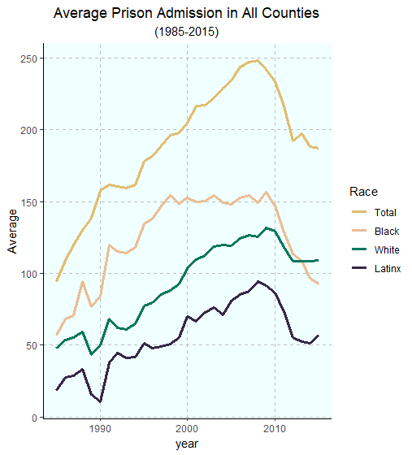
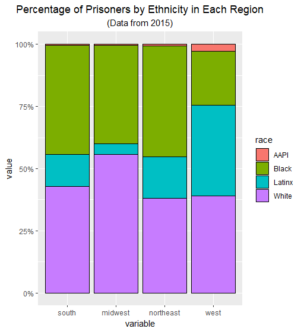
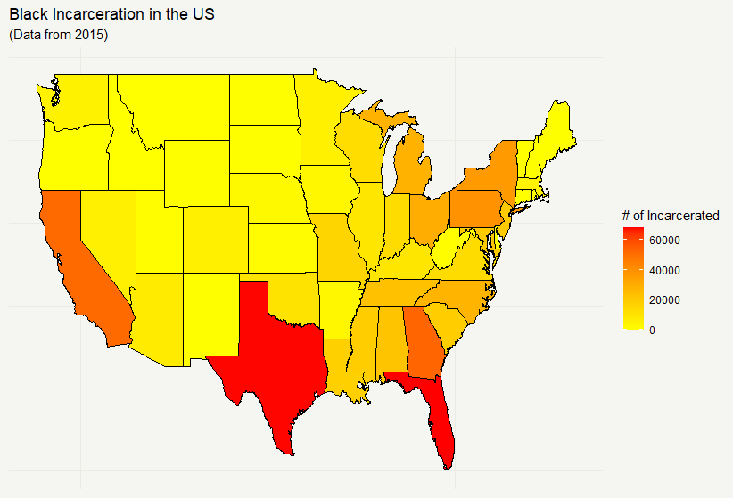

# **Analyzing Incarceration in the United States**

The following report analyzes incarceration levels across all 50 states, specifically how different ethnicities are affected and the prominence of incarceration within the four major regions. Results show minorities are disproportionately jailed in the majority of counties when compared to the much higher Caucasian populace. The subject at hand is near and dear to my heart, and I hope that my findings bring more awareness to the ill effects that over-policing and the war on drugs have had on American citizens. The Vera Institute provided the incarceration data, and for my analysis, I have chosen to examine the numbers from 1990 to 2015. The population only includes those of working age, 15 to 64. Incarcerated persons from both prison and jail are combined. I have also defined four regions in the country, determined by the US Census.

Northeast: CT, ME, MA, NH, RI, VT, NJ, NY, PA

South: DE, DC, FL, GA, MD, NC, SC, VA, WV, AL, KY, MS, TN, AR, LA, OK, TX

West: AZ, CO, ID, MT, NV, NM, UT, WY, AK, CA, HI, OR, WA

Midwest: IL, IN, MI, OH, WI, IA, KS, MN, MO, NE, ND, SD

##### Summary Info:

***Country Statistics***

Increase in Black prisoners: **323,704**\
Increase in White prisoners: **459,705**

Percentage of the Black population imprisoned: **2.4%**\
Percentage of the White population imprisoned: **0.6%**

***Northeast***\
Percentage of Black prisoners in the Northeast (Total Prison Population): **43%**\
Percentage of White prisoners in the Northeast (Total Prison Population): **37%**\
Percentage of Black people in the Northeast (Total Population): **12%**\
Percentage of White people in the Northeast (Total Population): **66%**

***South***\
Percentage of Black prisoners in the South (Total Prison Population): **43%**\
Percentage of White prisoners in the South (Total Prison Population): **42%**\
Percentage of Black people in the South (Total Population): **20%**\
Percentage of White people in the South (Total Population): **58%**

***West***\
Percentage of Black prisoners in the West (Total Prison Population): **20%**\
Percentage of White prisoners in the West (Total Prison Population): **36%**\
Percentage of Black people in the West (Total Population): **5%**\
Percentage of White people in the West (Total Population): **52%**

***Midwest***\
Percentage of Black prisoners in the Midwest (Total Prison Population): **37%**\
Percentage of White prisoners in the Midwest (Total Prison Population): **53%**\
Percentage of Black people in the Midwest (Total Population): **11%**\
Percentage of White people in the Northeast (Total Population): **77%**

This chart shows the increase of prison admissions over time (across the entire country) for the Black, White, and Latinx populations. It also includes the total prison admissions. I decided to have this chart in my report to show the highest and lowest points for prison admissions over the last 25 years. It showcases the disproportionate jailing of Black people in the past and conveys that the numbers have mainly decreased over time.

This chart shows each region of the United States and its respective imprisoned populace by race. It's important because when looking at the total population numbers of each race, one can take away that minorities are disproportionately jailed compared with the White and AAPI populace. It also shows which regions of the United States may be more prone to racist practices in their policing.

This chart strictly shows Black incarceration numbers by state. When we analyze this chart, we can see that states with a higher population imprison more Black people. We can also see a trend in the Southern United States. Texas and Florida seem to be the biggest offenders, with the Northeast and California not far behind.
